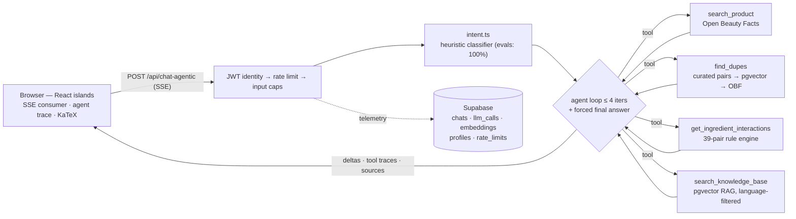

# CosmeticLens · 成分透视

**An AI ingredient analyst for skincare — agentic tool-calling, grounded RAG, and an eval harness that keeps it honest.** Bilingual (EN / 简体中文), publicly deployed, built end-to-end as a production-shaped LLM application.

**[→ Live demo](https://cosmetic-lens.vercel.app/en/)** · [Architecture deep-dive](docs/architecture.md) · [Eval harness](evals/README.md) · [Improvement plan](docs/improvement-plan.md)


<!-- TODO(demo-gif): record a ~30s GIF (product analysis with streaming + agent trace → dupe table → zh safety question with sources chips) and save as docs/assets/demo.gif, then uncomment:

-->

Paste a product name, an INCI list, or a photo of the label — get a structured, source-grounded analysis: what each ingredient does, whether the marketing claims hold up, what conflicts with what, and which affordable dupes share the formula. Ask anything in Chinese and the entire experience — retrieval included — switches language.

## Why this project is interesting (the engineering)

**Agentic pipeline with a visible brain.** The default chat endpoint hands the model four tools — Open Beauty Facts product lookup, curated + vector dupe retrieval, an ingredient-interaction rule engine, and pgvector RAG over the curated knowledge base — in a bounded loop (≤4 iterations, per-tool timeouts, a forced `tool_choice: 'none'` final turn so the user can never receive an empty answer). Every tool call streams to the UI as a live trace, and every grounded answer shows **source chips** naming the exact knowledge-base entries behind it. Grounding is mandatory for safety topics: the model may not answer "is X safe in pregnancy?" from memory.

**Evals as a first-class citizen.** Three suites, 124 golden cases (EN + ZH), LLM-as-judge rubric scoring, latency and cost capture — see [evals/](evals/README.md). The deterministic half runs in CI on every push: 105 unit tests including the full 60-case intent golden set and a regression test for every eval-discovered bug. LLM-judge runs stay manual — they cost money and carry variance, so CI checks only what's reproducible. The harness earned its keep on day one: it exposed that JavaScript's ASCII-only `\b` made every Chinese brand in the intent regex dead code (zh intent accuracy 55%), that Chinese dupe queries matched the *first* curated product because CJK was stripped during normalization, and that the agent loop could exhaust its iterations without answering. All fixed and re-measured the same day:

| Metric | Before | After |
|---|---|---|
| Intent accuracy (60 cases) | 76.7% — EN 87.5% / **zh 55%** | **100%** — EN 100% / zh 100% |
| Retrieval recall@6 / MRR (38 queries) | 97.4% / 0.77 | 97.4%+ / 0.77 (zh nickname gap fixed via aliases) |
| E2E structural pass | 80.8% (classic) / 84.6% (agentic) | 92.3% / **96.2%** |

**Classic RAG vs agentic tool-calling, measured on identical cases** (26 e2e scenarios, `gpt-4.1` judge):

| pipeline | struct pass | judge pass | intent ok | TTFT p50 | tools/case | est $ out/case |
|---|---|---|---|---|---|---|
| classic (pre-injection RAG) | 92.3% | 92.3% | 100% | 805 ms | 0 | $0.00043 |
| **agentic (default)** | **96.2%** | **100%** | 100% | 1.33 s | 0.69 | **$0.00012** |

Judge dimension means (agentic): groundedness 4.5, format 4.96, language fidelity 5.0, safety 5.0, dupe fidelity 5.0. The agentic pipeline buys higher quality at ~0.5 s extra time-to-first-token and lower output cost — that measurement is why it's the default. Both pipelines stay in the codebase behind a flag as a permanent A/B baseline.

**Security treated like it's someone else's wallet and data.** Identity comes only from verified Supabase JWTs (fixing an IDOR where any caller could read another user's pregnancy status by guessing a UUID). All public endpoints carry namespaced daily rate limits (`chat` / `vision` / `light` budgets, per-user or hashed-IP, atomic increment-then-check) plus input caps. Rate limiting fails open by design — availability over strictness, with the OpenAI spend cap as the hard backstop.

**Production plumbing.** Cross-device chat sync (Postgres + RLS as source of truth, localStorage as offline cache, one-time import, `?chat=` deep links). Language-filtered retrieval so zh users search zh embeddings. Real-token telemetry (`llm_calls`: model, tokens via `stream_options.include_usage`, latency, errors). Idempotent embedding seeds via content hashes — a no-change re-seed costs zero embedding calls. SSE streaming with abort propagation end-to-end.

**Rendering details that usually get skipped.** KaTeX math with a normalizer for the delimiter dialects LLMs actually emit (`\(...\)`, `\[...\]`, one-line `$$...$$`) — single `$` stays a currency symbol because this site talks about prices. A restricted emoji set renders as monochrome Phosphor line icons at display time, so model output matches the design system without banning emoji.

## Architecture



The classic pipeline (`/api/chat`) resolves product data, dupes, interactions, and RAG context *before* the LLM call and injects them into the prompt — kept as the measured baseline. Full contracts (SSE wire format, tool ordering, storage schema) live in [docs/architecture.md](docs/architecture.md).

## Tech stack

| Layer | Choice |
|---|---|
| Framework | [Astro 5](https://astro.build) (SSR) + React 19 islands, Tailwind, shadcn-style tokens, [Phosphor Icons](https://phosphoricons.com) |
| LLM | OpenAI Chat Completions (`gpt-4o-mini` agentic / `gpt-4.1-mini` classic, streaming + tool calling) |
| Retrieval | `text-embedding-3-small` + Supabase **pgvector** (cosine, language + type filters) |
| Data / Auth | [Supabase](https://supabase.com) — Postgres, RLS, Auth |
| External data | [Open Beauty Facts](https://world.openbeautyfacts.org) (verified INCI lists) |
| Vision | `gpt-4o-mini` OCR: photo of a label → structured INCI extraction |
| Evals | Custom harness — golden datasets, LLM-as-judge, latency/cost capture ([evals/](evals/README.md)) |
| Hosting | Vercel serverless |

The knowledge base is curated and versioned in-repo: 100 ingredients (bilingual, concentrations, pregnancy safety), 100 glossary entries, 39 interaction pairs, 30 dupe families with zh nickname aliases (小黑瓶 → Advanced Génifique).

## Run it locally

```bash
git clone https://github.com/Enrong-Pan-Peter/Cosmetic-Lens && cd Cosmetic-Lens
npm install
cp .env.example .env   # fill in OpenAI + Supabase keys
```

Database (Supabase SQL editor, in order): `supabase/schema.sql`, then each file in `supabase/migrations/`. Then seed the knowledge base and start:

```bash
node scripts/seed-embeddings.mjs   # incremental — re-runs only embed changed content
npm run dev                        # http://localhost:4321
```

Run the evals (add `RATE_LIMIT_BYPASS_TOKEN=<random>` to `.env`, dev server running):

```bash
node evals/run.mjs --suite all --pipeline both
```

## Deliberately out of scope

Model fine-tuning (the eval harness is the ML rigor here — measured, not vibed), PWA/offline, price tracking, community reviews, and social login. Each would add surface area without adding a new kind of signal. The full roadmap and the reasoning live in [docs/improvement-plan.md](docs/improvement-plan.md).

## Data & disclaimer

Ingredient information is educational, not medical advice — the app appends an explicit disclaimer to health-adjacent answers (pregnancy, prescription actives, skin conditions) and refuses to invent dupes that aren't in retrieved context. Product names are used nominatively; dupe comparisons are factual formulation notes.

## License

See [LICENSE](LICENSE).
