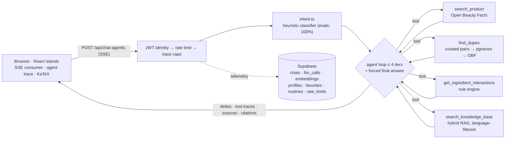

# CosmeticLens · 成分透视

**An AI ingredient analyst for skincare, built as a production-shaped LLM application: agentic tool-calling, grounded hybrid retrieval, real source citations, and an eval harness that keeps it honest.** Bilingual (EN / 简体中文) and publicly deployed.

**[→ Live demo](https://cosmetic-lens.vercel.app/en/)** · [Architecture deep-dive](docs/architecture.md) · [Eval harness](evals/README.md) · [Improvement plan](docs/improvement-plan.md)


Paste a product name, an INCI list, or a photo of the label. You get a structured, source-grounded analysis: what each ingredient does, whether the marketing claims hold up, what conflicts with what, and which affordable dupes share the formula. Ask anything in Chinese and the whole experience, retrieval included, switches language.

## Why this project is interesting (the engineering)

**An agentic pipeline you can watch think.** The default chat endpoint gives the model a set of tools (Open Beauty Facts product lookup, curated plus vector dupe retrieval, an ingredient-interaction rule engine, and pgvector RAG over the curated knowledge base) and runs a bounded loop. The loop caps at four iterations, enforces per-tool timeouts, and ends with a forced `tool_choice: 'none'` final turn so the user can never receive an empty answer. Every tool call streams to the UI as a live trace, and every grounded answer shows **source chips** naming the exact knowledge-base entries behind it. Grounding is mandatory on safety topics: the model may not answer "is X safe in pregnancy?" from memory.

**Hybrid retrieval, not just a vector search.** Retrieval fuses dense embeddings with a lexical match, combines the two rankings with Reciprocal Rank Fusion, and then reranks with a small feature score that rewards exact ingredient-name hits. A query-expansion step widens recall on short or noun-heavy queries, and a semantic cache serves repeat questions without a model call. Retrieval is language-filtered, so Chinese users search Chinese embeddings.

**Evals are a first-class citizen.** Three suites, 124 golden cases (EN and ZH), an LLM-as-judge rubric, plus latency and cost capture. See [evals/](evals/README.md). The deterministic half runs in CI on every push: 230 unit tests, including the full 60-case intent golden set and a regression test for every eval-discovered bug. Judge runs stay manual because they cost money and carry variance, so CI checks only what is reproducible. The harness earned its keep on day one. It found that JavaScript's ASCII-only `\b` turned every Chinese brand in the intent regex into dead code (Chinese intent accuracy was 55%), that Chinese dupe queries matched the *first* curated product because CJK was stripped during normalization, and that the agent loop could run out of iterations without answering. All three were fixed and re-measured the same day.

| Metric | Before | After |
|---|---|---|
| Intent accuracy (60 cases) | 76.7% (EN 87.5%, zh 55%) | 100% (EN 100%, zh 100%) |
| E2E structural pass | 80.8% classic, 84.6% agentic | 92.3% classic, 96.2% agentic |

Retrieval is measured separately, because the retrieval dataset itself grows over time and a raw temporal number would compare two different tests. On the same 38 queries, the hybrid pipeline beats dense-only retrieval by **+13 points of recall@6** (86.8% vs 73.7%). `node evals/compare.mjs` regenerates this before/after view from the recorded runs.

**Classic RAG vs agentic tool-calling, measured on identical cases** (26 e2e scenarios, `gpt-4.1` judge):

| pipeline | struct pass | judge pass | intent ok | TTFT p50 | tools/case | est $ out/case |
|---|---|---|---|---|---|---|
| classic (pre-injection RAG) | 92.3% | 92.3% | 100% | 805 ms | 0 | $0.00043 |
| **agentic (default)** | **96.2%** | **100%** | 100% | 1.33 s | 0.69 | **$0.00012** |

Judge dimension means for the agentic pipeline: groundedness 4.5, format 4.96, language fidelity 5.0, safety 5.0, dupe fidelity 5.0. The agentic pipeline buys higher quality for about half a second more time-to-first-token and lower output cost, and that measurement is why it is the default. Both pipelines stay in the codebase behind a flag as a permanent A/B baseline. These generation-quality numbers were measured on the previous default model. The app now runs `gpt-5.4-mini`, and re-running the suites with `evals/compare.mjs` refreshes the comparison.

**Security treated like it is someone else's data.** Identity comes only from verified Supabase JWTs. This fixed an IDOR bug where any caller could read another user's pregnancy status by guessing a UUID. Every authenticated and public endpoint carries a namespaced daily rate limit (`chat`, `vision`, and `light` budgets, keyed per user or hashed IP, atomic increment-then-check) plus input caps. Rate limiting fails open on purpose, favoring availability, with the OpenAI spend cap as the hard backstop. User content is redacted of obvious PII before it reaches logs, and a prompt-injection detector flags manipulation attempts in pasted ingredient text.

**Honest sourcing, never invented.** Ingredient pages cite real, resolvable sources. Compound identity links to the authoritative PubChem page, resolved by name to CID through PubChem's API. Efficacy background links to peer-reviewed reviews indexed by Europe PMC, which covers PubMed and MEDLINE, so every reference carries a real PMID and DOI. The app frames these as further reading rather than proof of a specific claim, and it refuses to present dupes that were not in retrieved context. No citation is ever generated by the model.

**Depth a real user would notice.** A 100-ingredient encyclopedia with bilingual detail pages, a routine conflict checker with a saved-routine library, a "My Shelf" of starred ingredients that syncs across devices when signed in, a skin-profile quiz that personalizes answers (for signed-out users too, through a privacy-preserving local profile), concern search ("what helps with redness?"), camera barcode scanning, shareable read-only analyses, one-click PDF export, dark mode, and a mobile-friendly layout.

**Production plumbing.** Cross-device chat sync with Postgres and RLS as the source of truth and localStorage as an offline cache. Real-token telemetry (`llm_calls` records model, tokens through `stream_options.include_usage`, latency, and errors). Idempotent embedding seeds keyed by content hash, so a no-change re-seed costs zero embedding calls. SSE streaming with abort propagation from the browser through to the model call.

**Rendering details that usually get skipped.** A KaTeX normalizer handles the delimiter dialects LLMs actually emit (`\(...\)`, `\[...\]`, one-line `$$...$$`), while a lone `$` stays a currency symbol because this site talks about prices. A restricted set of emoji renders as monochrome Phosphor line icons at display time, so model output matches the design system without banning emoji outright.

## Architecture



The classic pipeline (`/api/chat`) resolves product data, dupes, interactions, and RAG context *before* the model call and injects it into the prompt. It is kept as the measured baseline. Full contracts (the SSE wire format, tool ordering, storage schema) live in [docs/architecture.md](docs/architecture.md).

## Tech stack

| Layer | Choice |
|---|---|
| Framework | [Astro 5](https://astro.build) (SSR) with React 19 islands, Tailwind, shadcn-style tokens, [Phosphor Icons](https://phosphoricons.com) |
| LLM | OpenAI Chat Completions (`gpt-5.4-mini`, streaming and tool calling) |
| Retrieval | `text-embedding-3-small` with Supabase **pgvector**, hybrid (dense + lexical + RRF + feature rerank), language and type filters |
| Data / Auth | [Supabase](https://supabase.com): Postgres, RLS, Auth |
| External data | [Open Beauty Facts](https://world.openbeautyfacts.org) (verified INCI lists), [PubChem](https://pubchem.ncbi.nlm.nih.gov) and [Europe PMC](https://europepmc.org) (citations) |
| Vision | OCR of a label photo into a structured INCI list |
| Evals | Custom harness: golden datasets, LLM-as-judge, latency and cost capture, before/after comparison ([evals/](evals/README.md)) |
| Hosting | Vercel serverless |

The knowledge base is curated and versioned in the repo: 100 ingredients (bilingual, with concentrations and pregnancy safety), 100 glossary entries, interaction pairs, and dupe families with Chinese nickname aliases (小黑瓶 maps to Advanced Génifique).

## Run it locally

```bash
git clone https://github.com/Enrong-Pan-Peter/Cosmetic-Lens && cd Cosmetic-Lens
npm install
cp .env.example .env   # fill in OpenAI + Supabase keys
```

Set up the database in the Supabase SQL editor, in order: `supabase/schema.sql`, then each file in `supabase/migrations/`. Then seed the knowledge base and start the dev server:

```bash
node scripts/seed-embeddings.mjs   # incremental: only re-embeds changed content
npm run dev                        # http://localhost:4321
```

Optional data scripts (safe to re-run, they only add verified data):

```bash
node scripts/fetch-references.mjs         # PubChem compound pages for single-compound actives
node scripts/fetch-pubmed-references.mjs  # Europe PMC peer-reviewed reviews per active
```

Run the evals (add `RATE_LIMIT_BYPASS_TOKEN=<random>` to `.env`, with the dev server running):

```bash
node evals/run.mjs --suite all --pipeline both   # classic vs agentic
node evals/compare.mjs --save-baseline           # snapshot a baseline
node evals/compare.mjs                           # print before/after after later runs
```

## Deliberately out of scope

Model fine-tuning (the eval harness is the ML rigor here, measured rather than guessed), PWA and offline mode, price tracking, community reviews, and social login. Each would add surface area without adding a new kind of signal. The full roadmap and the reasoning live in [docs/improvement-plan.md](docs/improvement-plan.md).

## Data and disclaimer

Ingredient information is educational and is not medical advice. The app appends an explicit disclaimer to health-adjacent answers (pregnancy, prescription actives, skin conditions) and refuses to invent dupes that are not in retrieved context. Product names are used nominatively, and dupe comparisons are factual formulation notes.

## License

See [LICENSE](LICENSE).
