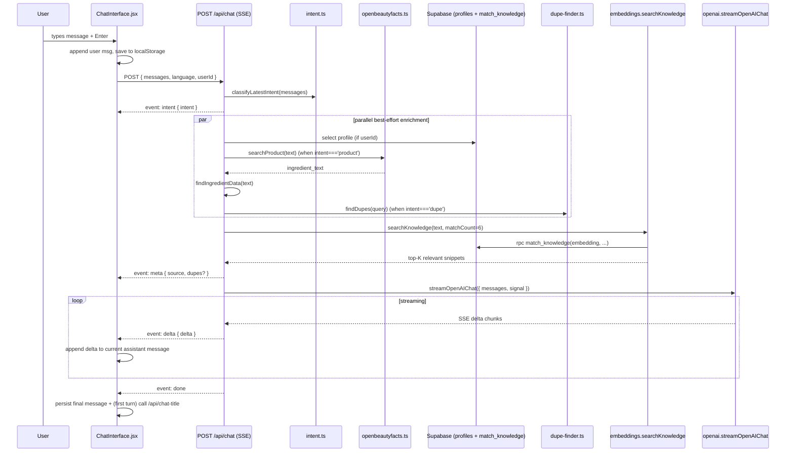

# CosmeticLens Architecture

**Status:** Living document — updated 2026-05-27 (post Phase 0 commercialization pass).
**Purpose:** Single source of truth for the project's structure, data flow, contracts, and invariants. Read this before making any non-trivial change so edits stay surgical.

---

## 0. How to use this document

- Each section ends with a **Key files** list — cite these by path in PRs and commits.
- Diagrams use Mermaid. Render in any Markdown viewer that supports it.
- **Contracts** (shaded with `> ⚠️`) must be preserved across changes. If you must break a contract, update this document in the same change.
- See [BUGS-HISTORY.md](BUGS-HISTORY.md) for the rolling changelog of fixes; this file describes the *current* design only.

---

## 1. Product overview

**CosmeticLens (成分透视)** is a bilingual (English / 简体中文) web app that helps consumers understand what is actually in their skincare/cosmetic products. It exposes three core user flows:

1. **Analyze a product** — paste a name or ingredient list → receive a structured analysis (key ingredients, claim verification, suitability, bottom line).
2. **Ask a knowledge question** — "Is retinol safe during pregnancy?" → conversational answer grounded in our curated knowledge base.
3. **Find a dupe** — request affordable alternatives to a product → curated dupe table + shared-ingredient rationale.

The app is positioned as an AI-powered analyst (RAG + heuristics + curated content) rather than a regulatory or medical product.

---

## 2. Tech stack

| Layer | Choice | Why |
|------|--------|-----|
| Framework | [Astro 5](https://astro.build) (`output: 'server'`) | Static-by-default with on-demand SSR per route; bundles React islands cleanly |
| UI | React 19 islands, Tailwind 3, shadcn-style CSS variables, [Phosphor Icons](https://phosphoricons.com) | Familiar component model with a maintainable design-token system |
| LLM | OpenAI Chat Completions (`gpt-4.1-mini` primary, `gpt-4o-mini` fallback) | Reliable, cheap multi-turn + streaming |
| Embeddings | OpenAI `text-embedding-3-small` (1536-dim) | Cost-efficient for RAG; matches `vector(1536)` schema |
| Database / Auth | [Supabase](https://supabase.com) — Postgres + `pgvector` + Auth | Single managed service for relational, vector, and auth |
| External data | [Open Beauty Facts](https://world.openbeautyfacts.org) API | Verified ingredient lists for known products (5 s timeout) |
| Markdown | `react-markdown` + `remark-gfm` | Renders LLM markdown with GFM tables |
| Hosting | Vercel (Serverless functions + static) via `@astrojs/vercel` | First-class Astro adapter |

**Versions of record:** see [package.json](../package.json). Node 18.17+ or 20+ recommended (22 LTS preferred for parity with Vercel runtime).

---

## 3. Repository layout

```
Cosmetic-Lens/
├─ src/
│  ├─ pages/                Astro routes; each .astro = a page
│  │  ├─ index.astro        Redirects / → /en/
│  │  ├─ en/                English routes
│  │  │  ├─ index.astro     Homepage
│  │  │  ├─ chat.astro      ChatInterface island
│  │  │  ├─ glossary.astro
│  │  │  ├─ history.astro
│  │  │  ├─ profile.astro
│  │  │  ├─ login.astro / signup.astro
│  │  │  └─ education/      Article index + [slug] detail
│  │  ├─ zh/                Mirror of en/
│  │  └─ api/               Server endpoints (POST/GET handlers)
│  │     ├─ chat.ts         SSE streaming chat (primary)
│  │     ├─ chat-title.ts   Smart-title summarizer
│  │     ├─ analyze.ts      Legacy single-turn analysis (cached)
│  │     ├─ profile.ts      Authenticated CRUD
│  │     ├─ history.ts      Authenticated list / delete
│  │     └─ search-product.ts  OBF passthrough
│  ├─ components/
│  │  ├─ layout/            BaseLayout, Navigation, Footer, LanguageSwitcher
│  │  ├─ chat/              ChatInterface and friends (largest surface)
│  │  ├─ auth/              LoginForm, SignupForm, AuthGuard
│  │  ├─ profile/           ProfileForm
│  │  ├─ glossary/          GlossaryTable
│  │  ├─ history/           HistoryList
│  │  └─ education/         ArticleCard, ArticleList, FunFactCard
│  ├─ lib/                  Pure library code (no Astro/React imports here)
│  │  ├─ intent.ts          Heuristic intent classifier (product/dupe/knowledge)
│  │  ├─ prompt.ts          System prompt builder + ingredient lookup + heuristics
│  │  ├─ openai.ts          OpenAI wrapper (call + retry + streaming)
│  │  ├─ embeddings.ts      pgvector RAG (searchKnowledge, searchDupeProducts)
│  │  ├─ dupe-finder.ts     Hybrid dupe lookup
│  │  ├─ openbeautyfacts.ts OBF API client
│  │  ├─ analyzer.ts        Single-turn analysis pipeline (used by /api/analyze)
│  │  ├─ supabase.ts        Two clients: anon + service-role
│  │  ├─ useAuth.jsx        React auth hook (client-only)
│  │  └─ cn.ts              Tailwind class helper
│  ├─ data/                 Curated JSON knowledge bases (versioned)
│  │  ├─ ingredients-database.json   100 ingredients (INCI, ZH, properties)
│  │  ├─ glossary-data.json          100 glossary entries
│  │  ├─ ingredient-interactions.json 39 interaction pairs
│  │  ├─ curated-dupes.json          30 product / dupe sets
│  │  ├─ translations-reference.json Bilingual term map (zh injection)
│  │  └─ system-prompt.md            Master LLM system prompt template
│  ├─ i18n/
│  │  ├─ en.json / zh.json           Translation maps
│  │  └─ utils.ts                    getTranslations, getLanguageFromURL
│  ├─ styles/global.css              Design tokens + animations
│  └─ env.d.ts                       ImportMetaEnv type declarations
├─ content/
│  ├─ en/articles/*.md       Education articles (frontmatter + body)
│  ├─ en/fun-facts.json      Did-You-Know cards
│  └─ zh/...                 Mirror
├─ scripts/seed-embeddings.mjs    Index all curated content into Supabase
├─ supabase/
│  ├─ schema.sql             Tables, indexes, RLS, functions
│  └─ migrations/            Forward-only SQL files
├─ public/                   Static assets (favicon.svg, images/*)
├─ docs/                     This folder
├─ plan-part-{1..5}.md       Original design documents (frozen)
├─ astro.config.mjs / vercel.json / tsconfig.json / tailwind.config.mjs
└─ .env.example              Required environment variables
```

**Top-level layout invariants:**

- Every page exists under `src/pages/{en,zh}/` — there is **no** `[lang]` dynamic route. Mirror EN ↔ ZH manually.
- `src/lib/` contains framework-agnostic TypeScript. **Never** import from `src/components/` or `astro:*` here.
- `src/data/*.json` is statically imported (compile-time bundled). Schema changes require both code update and re-running `scripts/seed-embeddings.mjs`.

---

## 4. Routing & pages

Astro maps files to routes. Two language sub-trees with identical structure.

| URL | File | Notes |
|-----|------|-------|
| `/` | `src/pages/index.astro` | Redirect to `/en/` |
| `/en/` | `src/pages/en/index.astro` | Marketing home |
| `/en/chat` | `src/pages/en/chat.astro` | `BaseLayout hideFooter={true}` + `<ChatInterface client:load>` |
| `/en/glossary` | `src/pages/en/glossary.astro` | Server-renders glossary JSON, hydrates `<GlossaryTable>` |
| `/en/education/` | `src/pages/en/education/index.astro` | `prerender = true` — content collection + fun-facts |
| `/en/education/[slug]` | `src/pages/en/education/[slug].astro` | `prerender = true` — markdown article detail |
| `/en/history` `/en/profile` | … | `<AuthGuard>` → React child |
| `/en/login` `/en/signup` | … | Centered auth forms |
| `/api/*` | `src/pages/api/*.ts` | All SSR; see §6 |

**Active link detection** uses `Astro.url.pathname === link.href` in `Navigation.astro` (case-sensitive, no trailing-slash normalization).

> ⚠️ **Contract — language switcher:** [LanguageSwitcher.jsx](../src/components/layout/LanguageSwitcher.jsx) **must** preserve `window.location.search` when swapping `/en` ↔ `/zh`. The chat page depends on `?chat=<id>` riding along (see §6.1).

**Key files:** [src/pages/](../src/pages/), [src/components/layout/Navigation.astro](../src/components/layout/Navigation.astro), [src/components/layout/BaseLayout.astro](../src/components/layout/BaseLayout.astro).

---

## 5. Frontend architecture

### 5.1 Layout shell

`BaseLayout.astro` is the only HTML shell. It accepts:

```ts
interface Props {
  title: string;
  description?: string;
  lang?: 'en' | 'zh';
  hideFooter?: boolean;
}
```

Responsibilities:

- `<html lang={lang === 'zh' ? 'zh-CN' : 'en'}>`
- Google Fonts: Inter + Noto Sans SC (preconnect + stylesheet)
- Open Graph + locale meta (no `og:image` or canonical yet — Phase 1 work)
- Body: `<Navigation>` + `<slot/>` + (`<Footer>` unless `hideFooter`)
- Body root class is `flex flex-col` plus `min-h-screen` (or `h-screen overflow-hidden` for chat)

### 5.2 React islands

All interactive components hydrate via `client:load` (eagerly) or `client:visible` (when scrolled into view).

| Island | Hydration | Owns |
|--------|-----------|------|
| `ChatInterface` | `client:load` | Chat state, SSE streaming, history (localStorage), URL `?chat=` sync |
| `ChatSidebar` | (nested) | History grouping (today/yesterday/week/older), delete, mobile drawer |
| `LanguageSwitcher` | `client:load` | Dropdown + path-swap that preserves search params |
| `AuthGuard` | `client:load` | Redirect to login if no session |
| `LoginForm` / `SignupForm` / `ProfileForm` | `client:load` | Forms + Supabase auth calls |
| `GlossaryTable` | `client:load` | Client-side search + sort over server-passed data |
| `HistoryList` | `client:load` | Fetch `/api/history`, paginate, delete |
| `FunFactCard` | `client:visible` | Accordion expand on click |

### 5.3 Design system

Defined in [src/styles/global.css](../src/styles/global.css) and surfaced through Tailwind in [tailwind.config.mjs](../tailwind.config.mjs).

CSS variables on `:root` (HSL triples — no `hsl(...)` wrapper):

```
--background      --foreground
--card            --card-foreground
--primary         --primary-foreground
--secondary       --secondary-foreground
--muted           --muted-foreground
--accent          --accent-foreground
--destructive     --destructive-foreground
--border --input --ring
--radius
--brand           --brand-foreground   (blue 221 83% 53%, mostly unused)
```

Tailwind exposes them as `bg-background`, `text-foreground`, `border-border`, etc. **Use semantic tokens** in new components — avoid `stone-*` / `gray-*` (chat code still has some of these; convert as you touch them).

Additional component classes:

- `.gradient-divider` — thin horizontal gradient line between sections.
- `.chat-bubble-enter` — slide-up entrance animation.
- `.scrollbar-thin` / `.sidebar-scrollbar` — custom thin scrollbars.
- `.thinking-dots` + `.thinking-dot` — bouncing dots while waiting for first token (Phase 0).
- `.streaming-caret` — blinking `▍` appended after in-flight assistant text (Phase 0).
- `.prose-analysis` — typography for LLM-rendered markdown.

**Dark mode** is **not** implemented today. There is no `.dark` block and `darkMode` is absent from `tailwind.config.mjs`. Do not add `dark:` variants until the toggle ships.

**Key files:** [src/components/layout/](../src/components/layout/), [src/styles/global.css](../src/styles/global.css), [tailwind.config.mjs](../tailwind.config.mjs).

---

## 6. Chat pipeline — the canonical flow

This is the most complex and most-edited area of the codebase. Most product behavior is decided here.

### 6.1 End-to-end sequence



### 6.2 SSE wire format (contract)

> ⚠️ **Contract — `/api/chat` response.** Any change here must be reflected in [src/components/chat/ChatInterface.jsx](../src/components/chat/ChatInterface.jsx) `consumeChatStream` parser.

Response is always `Content-Type: text/event-stream; charset=utf-8` with `Cache-Control: no-cache, no-transform`.

Event sequence (in order):

| Event | Payload | When |
|-------|---------|------|
| `intent` | `{ intent: 'product' \| 'dupe' \| 'knowledge' \| 'other' }` | Once, before any IO |
| `meta` | `{ source: 'verified' \| 'llm_knowledge', dupes?: DupeSuggestion[] }` | Once, after enrichment + dupe lookup |
| `delta` | `{ delta: string }` | Repeating during LLM stream |
| `done` | `{}` | Once, at end of stream |
| `error` | `{ error: string }` | Terminal — replaces `done` when something fails |

Each frame is exactly:

```
event: <name>
data: <single-line JSON>
\n
```

Multi-line JSON is not used. The parser splits on `\n\n` (double newline). Empty lines are skipped.

### 6.3 Intent classifier

Lives in [src/lib/intent.ts](../src/lib/intent.ts). Pure heuristic — no LLM calls. Two public exports:

```ts
classifyIntent(text, { previousIntent? }): ChatIntent
classifyLatestIntent(messages[]): ChatIntent     // uses 2nd-to-last user msg as previous
```

Order of checks (first match wins):

1. `looksLikeDupeRequest(text)` → `'dupe'`
2. `looksLikeIngredientList(text)` (≥4 commas + token shape) → `'product'`
3. `looksLikeProductName(text)` === `true` → `'product'`
4. Question hints (`what|how|why|recommend|...` / `什么|怎么|为什么|...`) → `'knowledge'`
5. Follow-up hints (`it|this|previous` / `它|这个|之前`) + `previousIntent` → inherit previous (except previous `'dupe'` → `'knowledge'`)
6. `looksLikeProductName(text)` === `'maybe'` and length ≤ 60 → `'product'`
7. Default → `'knowledge'`

> ⚠️ **Contract — system prompt expects an `[intent: ...]` tag** on the last user message ([src/data/system-prompt.md](../src/data/system-prompt.md) Conversation Mode section). The chat endpoint injects this before sending to OpenAI. Mode A/B/C in the prompt are selected from this tag.

### 6.4 Client-side state

`ChatInterface.jsx` is the orchestrator. Refs and state of record:

| State | Purpose | Persisted? |
|-------|---------|-----------|
| `messages` | Current conversation array | Snapshot saved to localStorage per turn |
| `isLoading` | A network request is in-flight | No |
| `streamingStarted` | First token has arrived | No |
| `error` | Surface API error in red banner | No |
| `activeChatId` | Which chat is currently open | URL (`?chat=`) + localStorage |
| `chatHistory` | All saved chats | `localStorage.cosmeticlens_chat_history` |
| `sidebarOpen` | Mobile drawer | No |
| `abortRef` | Current `AbortController` (`useRef`) | No |

**localStorage shape:**

```ts
type StoredChat = {
  id: string;
  title: string;            // initially first-50-chars; replaced by /api/chat-title
  messages: Message[];      // role: 'user' | 'assistant', content, source?, dupes?, intent?
  createdAt: string;        // ISO
  updatedAt: string;        // ISO
};
```

`STORAGE_KEY = 'cosmeticlens_chat_history'`. Never reads/writes directly — go through `loadHistory()` / `persistHistory()` / `saveChat()`. **v2 (P3.7):** persisted shape is `{ version: 2, chats: StoredChat[] }`; `loadHistory` still accepts the bare-array v1 form.

**Server sync (P3, 2026-07-07).** For authenticated users, localStorage is a working cache and Supabase is the source of truth: `saveChat`/`generateTitle` queue a debounced (800 ms) `PUT /api/chats/[id]` snapshot; deletes call `DELETE`; on login the client merges `GET /api/chats` into the sidebar (remote chats appear as stubs whose messages hydrate on select), offers a one-time import of local-only chats when the account is empty, and hydrates cross-device `?chat=<id>` deep links from the server. Sync is fire-and-forget — offline/anonymous behavior is unchanged. `sanitizeMessagesForServer` strips ephemeral fields and trims toolCalls before upload.

**URL state:** `?chat=<id>` is the only URL parameter the chat respects. Mounting reads it; `handleNewChat` / `handleSelectChat` / `handleDeleteChat` keep it in sync via `window.history.replaceState`.

> ⚠️ **Contract — abort.** Submitting or selecting a chat or pressing Stop must call `abortRef.current?.abort()` first. The in-flight `fetch('/api/chat')` is wired to that signal; without it, deltas continue arriving into a stale chat.

### 6.5 Streaming UI behavior

- While `isLoading && !lastAssistantMessage` → render `<ThinkingDots>` row.
- During delta arrival → mutate the last `_streaming` assistant message in place; `<AnalysisDisplay streaming={true}>` shows a `.streaming-caret` at the end.
- On `done` → finalize message (drop `_streaming` marker), save to localStorage, kick off `/api/chat-title` if first turn.
- On user Stop → keep partial content, mark `stopped: true`, freeze `[content || t.chat.stopped]`.
- On error → drop the `_streaming` placeholder, show `error` banner above input.

### 6.6 Action affordances (intent-gated, post Phase 0)

[AnalysisDisplay.jsx](../src/components/chat/AnalysisDisplay.jsx) renders follow-up buttons under an assistant message **only when not streaming**, **not stopped**, and gated by intent:

| Intent | Affordance | Action |
|--------|-----------|--------|
| `product` | "Find Similar Products" (`find_dupes` i18n key) | Sends `Find me a dupe for <prevUserContent>` (zh: `找平替：<>`) |
| `knowledge` | "Similar ingredients" (`similar_ingredients` i18n key) | Sends a markdown-table request for 5 similar ingredients |
| `dupe` | none — dupe results are already inline | — |
| `other` | none | — |

**Key files (chat):**
[ChatInterface.jsx](../src/components/chat/ChatInterface.jsx) · [ProductInput.jsx](../src/components/chat/ProductInput.jsx) · [ChatMessage.jsx](../src/components/chat/ChatMessage.jsx) · [AnalysisDisplay.jsx](../src/components/chat/AnalysisDisplay.jsx) · [ClaimsTable.jsx](../src/components/chat/ClaimsTable.jsx) · [DupeSuggestions.jsx](../src/components/chat/DupeSuggestions.jsx) · [ChatSidebar.jsx](../src/components/chat/ChatSidebar.jsx) · [ThinkingDots.jsx](../src/components/chat/ThinkingDots.jsx) · [src/lib/intent.ts](../src/lib/intent.ts) · [src/data/system-prompt.md](../src/data/system-prompt.md).

---

## 7. API endpoints

All routes live in `src/pages/api/*.ts`. Astro converts each exported `GET`/`POST`/`DELETE`/`PUT` to a Vercel serverless function.

| Route | Methods | Auth | Rate limit | Returns |
|-------|---------|------|------------|---------|
| `/api/chat` | POST | optional **Bearer JWT** (anonymous allowed; identity never from body) | `chat`: 20/day anon-IP, 100/day user | **SSE** stream (see §6.2) |
| `/api/chat-agentic` | POST | optional **Bearer JWT** (anonymous allowed; identity never from body) | `chat`: 20/day anon-IP, 100/day user | **SSE** stream with `tool_call` / `tool_result` events (see §7.4) — current default endpoint used by the chat UI |
| `/api/chat-title` | POST | none | `light`: 60/day per IP | `{ success, data: { title, fallback } }` |
| `/api/vision-extract` | POST | optional **Bearer JWT** | `vision`: 5/day anon-IP, 25/day user | `{ success, data: VisionExtractionResult, model }` (see §7.3) |
| `/api/analyze` | POST | optional **Bearer JWT** (identity never from body) | `chat` (shared budget) | `{ success, data, source, cached?, ... }` |
| `/api/profile` | GET, PUT | **Bearer JWT** | none | profile row JSON |
| `/api/history` | GET, DELETE | **Bearer JWT** | none | `{ success, data, total, limit, offset }` — **legacy** (UI no longer reads it; History page uses `/api/chats`) |
| `/api/chats` | GET | **Bearer JWT** | none | `{ success, data: [{ id, title, created_at, updated_at }] }` (P3 chat sync) |
| `/api/chats/[id]` | GET, PUT, DELETE | **Bearer JWT** + ownership | none | GET returns chat + messages; PUT = create-or-replace full snapshot (client-generated TEXT id, ≤80 msgs); DELETE cascades messages |
| `/api/search-product` | GET | none | `light`: 60/day per IP | OBF passthrough |

Rate limiting lives in [src/lib/rate-limit.ts](../src/lib/rate-limit.ts): daily windows via the `rate_limits` table + atomic `increment_rate_limit()` RPC, identifiers namespaced per cost class (`chat:` / `vision:` / `light:`), increment-then-check, **fail-open** if Supabase is unreachable (OpenAI dashboard spend cap is the hard backstop). 429 responses carry `error: 'rate_limit_exceeded'` + localized `message` + `Retry-After` (UTC midnight). Input caps: 40 messages / 8 000 chars per message on chat endpoints (400 on violation).

> ⚠️ **Security status (updated 2026-07-07).** The former body-`userId` IDOR is fixed: `/api/chat`, `/api/chat-agentic`, and `/api/analyze` now derive identity exclusively via [src/lib/auth.ts](../src/lib/auth.ts) `getUserFromRequest()` (verified Supabase JWT in the `Authorization` header); body `userId` is ignored/removed. Daily rate limiting is enforced on all six public endpoints via [src/lib/rate-limit.ts](../src/lib/rate-limit.ts) (see table above), replacing the old disabled `RATE_LIMIT_DISABLED` code in `/api/analyze`. Remaining Phase 1 items in [docs/improvement-plan.md](improvement-plan.md): key rotation, CSP header.

### 7.1 POST /api/chat

Request body:

```ts
{
  messages: Array<{ role: 'user' | 'assistant' | 'system'; content: string }>;
  language: 'en' | 'zh';
  userId?: string | null;
}
```

Validation in [chat.ts](../src/pages/api/chat.ts):
- `messages` must be a non-empty array
- Last user message must exist and `.content` must be a non-empty string
- Other fields are loosely coerced

Pipeline (inside the `ReadableStream.start` callback):

1. `classifyLatestIntent(messages)` → emit `event: intent`
2. If `userId`, best-effort `select * from profiles where user_id = userId`
3. If `intent === 'product'` and `looksLikeProductName !== false`: call `searchProduct` (OBF), then `extractIngredients`, then `findIngredientData`, then `enrichMessageWithIngredients`. On any failure, fall back to `source: 'llm_knowledge'`.
4. If `intent === 'dupe'`: `extractProductFromDupeRequest` (or fall back to prev user msg), then `findDupes`.
5. If we have verified ingredients: compute `getInteractionWarnings` (rule engine).
6. `searchKnowledge(userText, matchCount: 6)` filtered by `similarity > 0.3`. If dupes present, append their JSON to RAG context as `[dupe_suggestions]`.
7. Emit `event: meta`.
8. Build OpenAI messages: system prompt → optional RAG system message → last 10 history messages. Inject `[intent: <intent>]` and (if applicable) interaction-warnings text into the last user message.
9. `streamOpenAIChat({ messages, temperature: 0.7, maxTokens: 2048, signal: request.signal })`. Forward `delta` → SSE; on `done` close cleanly; on `error` emit `event: error` and close.

`request.signal` is the request's own AbortSignal; client disconnects (Stop button or page nav) propagate to the OpenAI fetch.

### 7.2 POST /api/chat-title

Body: `{ message: string, language: 'en' | 'zh' }`.
Returns: `{ success: true, data: { title: string, fallback: boolean } }`.

Uses `callOpenAIChatWithRetry` with a short, deterministic prompt (temp 0.3, max 30 tokens). Always returns success — on LLM failure, returns a truncated 40-char fallback with `fallback: true`.

> ⚠️ **Contract — title cleaning.** `cleanTitle()` strips surrounding quotes, trailing punctuation, and clamps to 80 chars. Future callers should display the returned title as-is.

### 7.3 POST /api/vision-extract (Phase 2)

Multimodal endpoint that runs OCR + structured extraction on a photo of a cosmetic product label, so users can analyze a product without typing the INCI list by hand.

**Request** — `multipart/form-data`:

| Field | Type | Required | Notes |
|-------|------|----------|-------|
| `image` | File | yes | JPG / PNG / WebP / GIF, ≤ 8 MB (`MAX_IMAGE_BYTES` in [vision.ts](../src/lib/vision.ts)) |
| `language` | string | no | `"en"` (default) or `"zh"` — only affects fallback error text |

**Pipeline** ([vision-extract.ts](../src/pages/api/vision-extract.ts) → [vision.ts](../src/lib/vision.ts)):

1. Server validates `Content-Type`, presence of `image`, MIME (`SUPPORTED_MIME_TYPES`) and size.
2. File is read into a `Buffer`, base64-encoded into a `data:image/...;base64,...` URL.
3. `extractIngredientsFromImage` calls `gpt-4o-mini` (vision-capable) with `response_format: { type: 'json_object' }` and `temperature: 0.1`. On API/network failure it falls back to `gpt-4.1-mini`.
4. Model returns a strict JSON object; `parseVisionContent` defensively validates every field, strips list prefixes from each ingredient, deduplicates, and clamps strings.
5. If the result has `confidence: "unreadable"` AND `ingredients: []`, the endpoint still returns 200 (so the client can render a clear "couldn't read the label" message) — it is the client's job to treat that as a soft error.

**Success response** (200):

```ts
{
  success: true,
  data: {
    ingredients: string[],           // INCI names, order preserved
    rawText: string,                 // full OCR text (≤ 4 000 chars)
    productName: string | null,      // brand + product if visible
    confidence: 'high' | 'medium' | 'low' | 'unreadable',
    warnings: string[],              // short notes ("blurry", "partially obscured", etc.)
    language: 'en' | 'zh' | 'other', // primary language of the label
  },
  model: 'gpt-4o-mini' | 'gpt-4.1-mini',
}
```

**Error responses** — all share `{ success: false, error, code }`:

| Status | Code | Cause |
|-------:|------|-------|
| 400 | `missing_image` | wrong Content-Type, missing field, or unparseable form data |
| 413 | `too_large` | file > 8 MB |
| 415 | `unsupported_type` | MIME not in whitelist |
| 500 | `api_key_missing` | `OPENAI_API_KEY` env var unset |
| 500 | `api_error` | OpenAI returned non-2xx |
| 500 | `invalid_response` | Model returned non-JSON content despite `response_format` |
| 502 | `network_error` | `fetch` itself failed (DNS, TLS, abort) |
| 500 | `internal_error` | uncaught exception in the handler |

**Client integration:**

The chat composer ([ProductInput.jsx](../src/components/chat/ProductInput.jsx)) exposes an upload button, a paste-image-from-clipboard handler, and a drag-and-drop zone. [ChatInterface.jsx](../src/components/chat/ChatInterface.jsx) holds the upload state, calls `/api/vision-extract`, then seeds the composer textarea via a `CustomEvent('cosmeticlens:set-text')` so the user can review the extracted ingredients before sending. When the message is sent, the user message gets a `fromPhoto: true` flag (plus `photoMeta` for diagnostics) so the [ChatMessage.jsx](../src/components/chat/ChatMessage.jsx) bubble can render an "Extracted from photo" badge.

> Privacy note: the image is **not** persisted server-side — it is forwarded directly to OpenAI and the response is returned to the client. The object URL used for the local preview is revoked after send / remove / unmount.

### 7.4 POST /api/chat-agentic (Phase 3)

Agentic alternative to `/api/chat`. Same request body and same set of SSE
events as `/api/chat`, **plus** three new events that expose the model's
tool-call activity. The chat UI ([ChatInterface.jsx](../src/components/chat/ChatInterface.jsx))
points at this endpoint by default via the `CHAT_ENDPOINT` constant — flip
to `/api/chat` to fall back to the classic pre-injection pipeline.

**Key difference from `/api/chat`.** The classic endpoint resolves
products, dupes, interactions and RAG snippets **before** the LLM is
called, then injects them into the prompt. The agentic endpoint hands
the same capabilities to the model as **OpenAI tools** and lets it decide
which to call. This pattern is more flexible (the model can skip work for
trivial questions, chain multiple lookups, or re-query with refined
arguments), at the cost of an extra round-trip per tool call.

**Tools exposed** ([tools.ts](../src/lib/tools.ts), `OPENAI_TOOLS`):

| Tool | Wraps | When the model should call it |
|------|-------|-------------------------------|
| `search_product(query)` | `searchProduct` → OBF | User names a specific product |
| `find_dupes(target_product)` | `findDupes` (curated → vector → OBF) | User asks for alternatives |
| `get_ingredient_interactions(ingredients[], is_pregnant?)` | `getInteractionWarnings` | After an ingredient list is known |
| `search_knowledge_base(query, limit?)` | `searchKnowledge` (pgvector RPC) | General "is X safe?" questions |

The model is guided by `buildAgenticInstructions(lang)`, which is appended
to the existing system prompt. That guide caps the model at "at most 3
tool calls per turn" and tells it which order is sensible
(`search_product` → `get_ingredient_interactions`).

**Loop control** ([chat-agentic.ts](../src/pages/api/chat-agentic.ts)):

```
for iter in 0..MAX_TOOL_ITERATIONS (=4):
    emit  agent_step { step }
    turn = streamOneTurn(messages)     ← streams text deltas to client
    push  assistantMessage(content, tool_calls)
    if turn.toolCalls is empty: break
    for tc in turn.toolCalls:
        emit  tool_call { id, name, arguments }
        result = executeToolCall(tc, ctx)         ← 8 s timeout per tool
        emit  tool_result { id, name, success, durationMs, summary }
        push  toolMessage(tool_call_id, JSON.stringify(result.result))
emit  done
```

`executeToolCall` is the trust boundary: every tool runs inside a
`withTimeout` wrapper and returns a structured `ToolCallResult` even on
failure, so a broken tool never aborts the loop — the model just sees an
error string in the tool message and re-plans.

**Request** — identical to `/api/chat`:

```ts
{
  messages: { role: 'user' | 'assistant'; content: string }[],
  language: 'en' | 'zh',
  userId?: string | null
}
```

**SSE event reference:**

| Event | When | Payload |
|-------|------|---------|
| `intent` | once, up-front | `{ intent: 'product' \| 'dupe' \| 'knowledge' \| 'other' }` |
| `meta`   | once, up-front | `{ source: 'agentic', mode: 'agentic' }` |
| `agent_step` | start of each iteration | `{ step: number, status: 'thinking' }` |
| `tool_call` | when the model commits to a tool | `{ id, name, arguments }` |
| `tool_result` | after the tool executor returns | `{ id, name, success, durationMs, summary, dupes?, verified? }` — `dupes` when `find_dupes` succeeds; `verified: true` when `search_product` finds a match |
| `delta_reset` | after a tool-planning turn (model emitted `tool_calls` plus throwaway text) | `{}` — client clears buffered assistant text |
| `delta` | answer tokens (final turn, or any turn without tool calls) | `{ delta: string }` |
| `done` | end of stream | `{}` |
| `error` | fatal error | `{ error: string }` |

**Client integration.** `consumeChatStream` in
[ChatInterface.jsx](../src/components/chat/ChatInterface.jsx) handles all
new events. Tool calls are accumulated by id into a `toolCalls` array on
the streaming assistant message; the message object grows fields
`{ mode: 'agentic', toolCalls: [{ id, name, arguments, status, summary?,
durationMs?, success? }] }`. [ChatMessage.jsx](../src/components/chat/ChatMessage.jsx)
renders `<AgentTrace>` above the prose answer whenever
`message.toolCalls` is non-empty or the message is still streaming in
agentic mode.

> ⚠️ **Contract — tool message ordering.** Per OpenAI's spec, when the
> model emits `tool_calls`, the **assistant** message containing those
> calls MUST be pushed onto `messages` BEFORE any `role: 'tool'`
> messages, and every `tool_call_id` must be answered by exactly one
> tool message. The loop in `chat-agentic.ts` enforces this — don't
> reorder.

> ⚠️ **Contract — `MAX_TOOL_ITERATIONS = 4`.** Safety cap to prevent
> infinite tool loops if the model keeps re-calling tools. If you raise
> it, also raise per-request cost expectations.

> ⚠️ **Contract — forced final answer (2026-07-07).** If the loop exhausts
> `MAX_TOOL_ITERATIONS` while the model is still requesting tools (or a
> turn ends with neither tools nor text), the endpoint runs one extra
> `streamOneTurn` with `tool_choice: 'none'` so an answer is always
> streamed — previously the user could get an empty bubble (eval finding
> e2e-002). This turn emits `agent_step { step: 5, status: 'answering' }`.

### 7.5 POST /api/analyze (legacy)

Single-turn analysis. Used by an older entry point — **not** by the chat page anymore. Pipeline ([analyzer.ts](../src/lib/analyzer.ts)):

1. Look up `analysis_cache` by normalized product name (30-day TTL).
2. Three-tier ingredient resolution: user paste → OBF → LLM knowledge fallback.
3. Optional profile load.
4. `callOpenAIWithRetry`.
5. Write `analysis_cache` row.
6. Write `analysis_history` row if `userId` present.

Kept around for cache reuse and potential future homepage live-demo. Do not remove without checking [analyze.astro](../src/pages/) callers.

### 7.6 /api/profile and /api/history

These verify the `Authorization: Bearer <token>` header via `supabase.auth.getUser(token)`. Both use `createServerClient()` (service role) so they bypass RLS — the route handler is the auth boundary. Returns `401 unauthorized` on missing/invalid token.

Profile fields are not currently enum-validated server-side; the database CHECK constraints catch bad input.

**Key files:** [src/pages/api/](../src/pages/api/).

---

## 8. Library modules (`src/lib/`)

| File | Lines (~) | Role | Notable exports |
|------|---------:|------|-----------------|
| [openai.ts](../src/lib/openai.ts) | 290 | OpenAI Chat Completions wrapper | `callOpenAIWithRetry`, `callOpenAIChatWithRetry`, **`streamOpenAIChat` (async generator, Phase 0)** |
| [prompt.ts](../src/lib/prompt.ts) | 473 | System prompt builder + ingredient lookup + heuristics | `buildSystemPrompt`, `findIngredientData`, `getInteractionWarnings`, `formatInteractionWarnings`, `looksLikeProductName`, `looksLikeDupeRequest`, `extractProductFromDupeRequest`, `enrichMessageWithIngredients`. **Has `@ts-nocheck` at the top** — types should be added in Phase 8. |
| [intent.ts](../src/lib/intent.ts) | 95 | Heuristic intent classifier | `classifyIntent`, `classifyLatestIntent`, type `ChatIntent` |
| [embeddings.ts](../src/lib/embeddings.ts) | 100 | Embedding + RAG | `generateEmbedding`, `searchKnowledge`, `searchDupeProducts`, `indexContent` (used by seed script only) |
| [dupe-finder.ts](../src/lib/dupe-finder.ts) | 134 | Hybrid dupe lookup | `findDupes(query, ingredientList?, lang?)` — curated → vector → OBF |
| [openbeautyfacts.ts](../src/lib/openbeautyfacts.ts) | 100 | OBF search client | `searchProduct`, `getProductByBarcode` (unused), `extractIngredients(product, lang)` |
| [vision.ts](../src/lib/vision.ts) | 220 | OpenAI Vision OCR for ingredient labels (Phase 2) | `extractIngredientsFromImage`, `MAX_IMAGE_BYTES`, `SUPPORTED_MIME_TYPES`, types `VisionExtractionResult`, `VisionExtractionResponse` |
| [tools.ts](../src/lib/tools.ts) | 380 | Tool/function-calling registry for agentic chat (Phase 3) | `OPENAI_TOOLS`, `executeToolCall`, `MAX_TOOL_ITERATIONS`, types `ToolName`, `ToolCallRequest`, `ToolCallResult`, `ToolContext` |
| [analyzer.ts](../src/lib/analyzer.ts) | 239 | Single-turn analysis pipeline | `analyzeProduct(request)` — used by `/api/analyze` |
| [supabase.ts](../src/lib/supabase.ts) | 14 | Supabase clients | `supabase` (anon), `createServerClient()` (service role) |
| [useAuth.jsx](../src/lib/useAuth.jsx) | 61 | React auth hook | `useAuth()` — client-side only |
| [cn.ts](../src/lib/cn.ts) | 6 | Tailwind class helper | `cn(...inputs)` |

### 8.1 Heuristics in `prompt.ts`

These regex-based classifiers are widely depended on. Treat as a stable API:

- `looksLikeProductName(text): boolean | 'maybe'`
  - `false` on questions, long text (>100), 4+ commas (ingredient lists)
  - `true` when a known brand appears (`KNOWN_BRANDS` regex)
  - `'maybe'` for short title-cased text
- `looksLikeDupeRequest(text): boolean` — checks `DUPE_PHRASES_EN` / `DUPE_PHRASES_ZH`
- `extractProductFromDupeRequest(text): string | null` — strips the dupe phrase to isolate the product name

### 8.2 Ingredient matching

`findIngredientData(ingredientList)` splits the list on `,` or newline, then for each token does substring matching against `ingredients-database.json`. **Currently O(n × 100)** — fine for our 100-entry DB; would need a normalized name index at scale.

### 8.3 Interaction warnings

`getInteractionWarnings(inciNames, userProfile, lang)` walks the 39 pairs in `ingredient-interactions.json`. Special-cases:

- `pair.context === 'pregnancy'` only fires if `userProfile.is_pregnant === true`
- Otherwise, both ingredients in the pair must appear in `inciNames` (substring match through `INTERACTION_ALIASES`)

### 8.4 OpenAI wrapper

[openai.ts](../src/lib/openai.ts) constants:

```ts
PRIMARY_MODEL  = 'gpt-4.1-mini'
FALLBACK_MODEL = 'gpt-4o-mini'
```

Retry behavior (`retryLoop`):
- Up to 3 attempts
- Retryable when the error message matches `/\b(429|rate|5\d{2})\b/` (narrowed in Phase 0 — was previously matching any literal `'5'`)
- Exponential backoff: 1s, 2s, 4s

Streaming (`streamOpenAIChat`):
- Async generator yielding `{ type: 'delta'|'done'|'error', delta?|error? }`
- Initial connection failures on the primary model fall through to the fallback model (`streamWithModel`)
- Once data has begun arriving, **no model fallback** — we never silently switch mid-response
- Aborting via `signal` cleanly cancels both the `fetch` and the inner reader

> ⚠️ **Contract — keep the streaming async-generator shape.** Both server route (`/api/chat`) and the dispatcher in `analyzer.ts` (future agent loop) rely on it.

---

## 9. Data layer (`src/data/`)

Curated JSON files are statically imported and bundled into the server (and parts of the seed script). They are the **source of truth** for our knowledge; the LLM acts only as a presenter when these match.

| File | Rows | Schema highlights | Used by |
|------|-----:|-------------------|---------|
| `ingredients-database.json` | 100 + `metadata` + `categories[]` | `id`, `inci_name`, `chinese_name`, `aliases_en[]`, `aliases_zh[]`, `category`, `functions[]`, `evidence_level`, `skin_types[]`, `concerns_addressed[]`, `interactions[]`, `irritation_potential`, `pregnancy_safe`, `notes_en/zh` | `prompt.findIngredientData`, embedding seed |
| `glossary-data.json` | 100 + meta | `inci_name`, `chinese_name`, `aliases`, `category`, `function_en/zh`, `notes` | `<GlossaryTable>`, embedding seed |
| `ingredient-interactions.json` | 39 pairs + meta | `ingredients[]`, `ingredients_zh[]`, `level` (`info`/`caution`/`avoid`), optional `context` (`pregnancy`), `warning_en/zh` | `prompt.getInteractionWarnings`, embedding seed |
| `curated-dupes.json` | 30 sets + meta | `id`, `original.{product,brand,category,key_actives[]}`, `dupes[].{product,brand,price_tier,key_similarities,notes_en,notes_zh}` | `dupe-finder.findDupes` curated path, embedding seed |
| `translations-reference.json` | 31 bilingual term pairs | `section_headers`, `table_headers`, `verdicts`, `skin_types`, `common_terms` — each `{ en, zh }` | Injected into Chinese system prompt by `buildSystemPrompt` |
| `system-prompt.md` | (template) | Master LLM system prompt with `{{LANGUAGE}}` and `{{USER_PROFILE}}` placeholders; defines analysis output format, claims table, **Mode A/B/C** routing, conversation mode rules | `prompt.buildSystemPrompt` |

### 9.1 System-prompt modes (Phase 0 expansion)

The system prompt now defines three modes selected via the `[intent: ...]` tag on the latest user message:

- **Mode A — verified ingredients (`intent: product` + `[source: verified]`)** — full structured output (Quick Verdict / Key Ingredients / Claims Check / Best For / Bottom Line) with `CLAIMS_DATA` JSON block.
- **Mode B — LLM knowledge fallback (`intent: product` + `[source: llm_knowledge]`)** — same output format prefixed with a confidence banner.
- **Mode C — dupe request (`intent: dupe`, Phase 0)** — concise dupe-only response: 1–2 sentence hero-ingredient summary + dupes table (drawn from `[dupe_suggestions]` context only) + one-line caveat. **No `CLAIMS_DATA` block.**

For `intent: knowledge` (with or without preceding product), the prompt rules say to **skip structured output** and answer conversationally, ending with 3–5 related ingredients.

> ⚠️ **Contract — never invent dupes.** The Mode C rules instruct the model to **only** use products provided in `[dupe_suggestions]`. The chat endpoint guarantees those come from `curated-dupes.json` via `findDupes`.

### 9.2 Article content collection

`content/{en,zh}/articles/*.md` are imported via Astro's `import.meta.glob`. Frontmatter:

```yaml
title, title_zh?, description, description_zh?, category, readingTime, author, publishedAt, updatedAt, relatedIngredients[]?
image?   # optional — not used by any current article
```

Only the EN glob path is wired into [src/pages/en/education/index.astro](../src/pages/en/education/index.astro). The ZH article files exist but aren't yet listed there (audit finding, not fixed in Phase 0).

**Key files:** [src/data/](../src/data/), [content/](../content/).

---

## 10. Database (Supabase)

Schema lives in [supabase/schema.sql](../supabase/schema.sql). Forward-only migrations in [supabase/migrations/](../supabase/migrations/).

### 10.1 Tables

| Table | Purpose | Key columns | RLS |
|-------|---------|-------------|-----|
| `profiles` | User skin profile (skin_type, sensitivity, allergies[], concerns[], is_pregnant, price_preference, preferred_language) | `user_id` FK auth.users (UNIQUE) | user can SELECT/UPDATE own |
| `analysis_history` | One row per user-saved analysis | `user_id`, `product_name`, `analysis_result jsonb`, `language`, `source`, `created_at` | user can SELECT/INSERT/DELETE own |
| `analysis_cache` | Shared cache of recent analyses | `product_name_normalized` UNIQUE, `analysis_result_en jsonb`, `analysis_result_zh jsonb`, `updated_at` | authenticated read-all |
| `rate_limits` | Daily request counters per identifier | `(identifier, date)` UNIQUE; `identifier_type ∈ {user, ip}` | user can SELECT own |
| `knowledge_embeddings` | RAG store | `content`, `content_type`, `metadata jsonb`, `language`, `embedding vector(1536)`, `content_hash` (seed idempotency) | public read; service_role full |
| `chats` (P3) | Synced conversations | `id TEXT` (client-generated), `user_id`, `title`, timestamps | owner-only CRUD |
| `chat_messages` (P3) | Messages per chat | `chat_id`, `seq`, `role`, `content`, `metadata jsonb` (intent/source/dupes/toolCalls/sources), `UNIQUE(chat_id, seq)` | owner-only via chats join |
| `llm_calls` (P4.6) | LLM telemetry | `endpoint`, `model`, `prompt_tokens`, `completion_tokens`, `latency_ms`, `ok`, `error` | service-role only (RLS on, no policies) |

**Indexes:** B-tree on user_id, created_at, product_name, rate_limits composite. **No HNSW/IVFFlat vector index yet** — `match_knowledge` does full-scan cosine distance. Acceptable while embeddings count is ~300; revisit at the 10k row mark.

### 10.2 Functions

| Function | Signature | Purpose |
|----------|-----------|---------|
| `increment_rate_limit(p_identifier, p_identifier_type)` | returns count | Atomic upsert + increment |
| `check_rate_limit(p_identifier, p_limit)` | returns bool | Convenience check (unused by API; `/api/analyze` uses inline query) |
| `update_profile_timestamp()` | trigger | Updates `updated_at` on profile UPDATE |
| `clean_old_cache(days_old)` | void | Deletes old cache rows (not wired to cron in repo) |
| **`match_knowledge(query_embedding vector(1536), match_count, filter_type, filter_language)`** | table | Cosine distance via `<=>`; returns `id, content, content_type, metadata, language, similarity`. `filter_language` added 2026-07-07 (P4.1) — `searchKnowledge` passes the UI language and gracefully retries without it if the migration isn't applied |

### 10.3 RLS

`profiles`, `analysis_history`, `rate_limits` have per-user row policies. `analysis_cache` is read-all for authenticated users (cache is shared). `knowledge_embeddings` is **publicly readable** (so anon RAG queries work) and service-role-writable.

`createServerClient()` uses the service role key and bypasses RLS. The API route handler is the trust boundary — adding auth checks at the route level (Phase 5 work) is the planned hardening.

### 10.4 Migration: content types

[supabase/migrations/20250302_add_content_types.sql](../supabase/migrations/20250302_add_content_types.sql) expands the `content_type` CHECK on `knowledge_embeddings` to include `'glossary'`, `'interaction'`, `'product'` (in addition to ingredient, article, faq, regulation).

**Key files:** [supabase/schema.sql](../supabase/schema.sql), [supabase/migrations/](../supabase/migrations/).

---

## 11. RAG / embeddings

### 11.1 Content type taxonomy

`knowledge_embeddings.content_type` is one of:

- `ingredient` — entries from `ingredients-database.json`
- `glossary` — entries from `glossary-data.json`
- `interaction` — from `ingredient-interactions.json`
- `product` — curated dupes (the "original" and each dupe entry) from `curated-dupes.json`
- `article` — markdown article chunks (1500-char chunks from `content/**/*.md`)
- `faq` — fun facts from `content/{en,zh}/fun-facts.json`

`searchKnowledge(query, { matchCount, filterType })` accepts `filterType` to restrict the search (e.g. `'product'` for dupe candidates).

### 11.2 Seed script

[scripts/seed-embeddings.mjs](../scripts/seed-embeddings.mjs) — invoked manually with `node scripts/seed-embeddings.mjs` (requires `dotenv/config` loading `.env`).

Steps:

1. **DELETE** all rows from `knowledge_embeddings` except a sentinel id `00000000-…` (full wipe).
2. Walk each data source, build `{ content, content_type, metadata, language }` rows.
3. For each row: call OpenAI embeddings, INSERT.
4. Sequential, with a 250 ms delay between calls. ~295 rows total → ~75 s per full seed.

> **Seed is incremental since 2026-07-07 (P4.7).** Each row carries a sha256 `content_hash`; unchanged rows are skipped (no embedding API call), stale rows are pruned at the end. A no-change re-run costs ~0 embeddings and a few seconds. If the `content_hash` column is missing (migration not applied), the script warns and falls back to plain inserts without pruning.

### 11.3 Retrieval at chat time

In [src/pages/api/chat.ts](../src/pages/api/chat.ts) step 5:

```ts
const results = await searchKnowledge(userText, { matchCount: 6 });
const relevant = results.filter((r) => r.similarity > 0.3);
```

Top 6 candidates with cosine similarity > 0.3 are concatenated into a system message:

```
Here is relevant knowledge from our ingredient and skincare database. Use it to ground your answer when applicable:

[ingredient] niacinamide is a form of vitamin B3...
---
[interaction] Vitamin C + Niacinamide: ...
```

Dupes (when present) are appended as `[dupe_suggestions]` with the full JSON of `dupeResult.dupes`.

**Key files:** [src/lib/embeddings.ts](../src/lib/embeddings.ts), [scripts/seed-embeddings.mjs](../scripts/seed-embeddings.mjs).

---

## 12. Internationalization

[src/i18n/utils.ts](../src/i18n/utils.ts) is a thin wrapper:

```ts
getTranslations(lang): typeof enJson
getLanguageFromURL(pathname): 'en' | 'zh'
getAlternateLanguagePath(currentPath, currentLang)   // unused — LanguageSwitcher inlines logic
```

`en.json` and `zh.json` share keys. Pages pass the full `t` object to React children via `translations` prop.

**Drift caveat:** Several components still use inline `lang === 'zh' ? '...' : '...'` ternaries instead of looking up keys. The new Phase 0 components added the keys (`chat.stop`, `chat.thinking`, `chat.stopped`, `chat.send`, `analysis.find_dupes`, `analysis.similar_ingredients`) and use them where `t` is in scope. Leaf components still use inline ternaries. Phase 8 will sweep this.

`zh.json` `site.name = "护肤黄金眼"` but the brand bar in `Navigation.astro` hardcodes `"成分透视"`. The latter wins everywhere — treat `成分透视` as the canonical zh brand string until reconciled.

**Key files:** [src/i18n/](../src/i18n/).

---

## 13. Configuration & environment

`.env` (gitignored; example in [.env.example](../.env.example)):

| Variable | Used by | Notes |
|----------|---------|-------|
| `OPENAI_API_KEY` | server only | Required for `/api/chat`, `/api/chat-title`, `/api/analyze`, seed script |
| `PUBLIC_SUPABASE_URL` | client + server | |
| `PUBLIC_SUPABASE_ANON_KEY` | client + server | |
| `SUPABASE_SERVICE_ROLE_KEY` | server only | Powers `createServerClient()`; bypasses RLS |
| `PUBLIC_SITE_URL` | server | Set to `http://localhost:4321` for local dev; production value lives in Vercel env vars |

`PUBLIC_*` prefix exposes the variable to client bundles (Astro convention).

[astro.config.mjs](../astro.config.mjs):

- Integrations: `react()`, `tailwind()`, `vercel()` adapter
- `output: 'server'`
- `vite.ssr.noExternal`: `react-markdown`, `remark-gfm`, `@phosphor-icons/react` (so they bundle into the server function instead of being externalized)

[vercel.json](../vercel.json):

- Security headers: `X-Content-Type-Options: nosniff`, `X-Frame-Options: DENY`
- `/api/*` set to `Cache-Control: no-store`

[tsconfig.json](../tsconfig.json):

- Extends `astro/tsconfigs/strict`
- Path aliases: `@/*`, `@components/*`, `@lib/*`, `@data/*` (rarely used — most imports are relative)
- `jsx: react-jsx`

---

## 14. Build & deploy

```bash
npm run dev       # astro dev → http://localhost:4321
npm run build     # astro build (server + static + Vercel function)
npm run preview   # astro preview
```

Production build outputs:

- `dist/client/` — static client chunks
- `dist/server/` — server entry (`entry.mjs`)
- `.vercel/output/` — Vercel build adapter output (function + static)

Deployment is Vercel-only; the `@astrojs/vercel` adapter handles function packaging. Vercel runtime is Node 22 (warning is emitted at build time if local Node ≠ 22).

> ⚠️ **Contract — no native-binary dependencies in API routes.** They bundle into a single Vercel serverless function. Anything that needs `sharp`/`canvas`/etc. must be served from a separate route configured for the Node runtime.

---

## 15. Local development

Prerequisites:

- macOS / Linux. Node 20+ (22 LTS preferred). `npm install`.
- A `.env` populated with the variables in §13. For Supabase, you can use the hosted project credentials (no local Postgres needed).

Start the dev server:

```bash
npm run dev
```

Quick smoke checks:

```bash
# 1. App renders
curl -sS -o /dev/null -w "%{http_code}\n" http://localhost:4321/en/chat

# 2. SSE chat endpoint emits the expected event sequence
curl -N -s -X POST http://localhost:4321/api/chat \
  -H 'Content-Type: application/json' \
  -d '{"messages":[{"role":"user","content":"What is niacinamide?"}],"language":"en"}'

# 3. Title summarizer
curl -s -X POST http://localhost:4321/api/chat-title \
  -H 'Content-Type: application/json' \
  -d '{"message":"Is retinol safe during pregnancy?","language":"en"}'
```

Re-seeding embeddings:

```bash
node scripts/seed-embeddings.mjs
```

Typecheck + build:

```bash
npx astro check     # 0 errors expected
npm run build       # ✓ Complete expected
```

---

## 16. Invariants & gotchas

The list below captures non-obvious constraints. If a change breaks one, update this file.

1. **`@ts-nocheck` in `src/lib/prompt.ts`** disables TS for the whole file. Don't rely on its types being checked at compile time. Phase 8 will clean this up.
2. **Service-role Supabase client bypasses RLS.** Anything written in an API route that uses `createServerClient()` is the auth boundary. **Never trust `userId` from request bodies** — derive identity via `getUserFromRequest()` in [src/lib/auth.ts](../src/lib/auth.ts) (this is the only sanctioned request→identity path; enforced on chat, chat-agentic, analyze since 2026-07-07).
3. **The chat endpoint streams unconditionally.** Old non-streaming JSON callers will receive a `text/event-stream` body. The frontend has been updated; any external scripts hitting `/api/chat` must read SSE.
4. **`AbortController` must abort previous request before starting a new one.** See `handleAnalyze` in `ChatInterface.jsx`. Otherwise deltas from a stale stream may land in the new chat.
5. **`?chat=<id>` is the only persisted URL state.** Adding more params requires updating `LanguageSwitcher.jsx` and the `updateUrlChatId` helper.
6. **The dupes RAG context is JSON.** The system prompt's Mode C tells the model to draw products from `[dupe_suggestions]` only; do not let the model paraphrase it into prose silently.
7. **Embeddings are model-locked.** Any change in embedding model requires re-seeding the entire `knowledge_embeddings` table and matching the DB column dimension. Today: `text-embedding-3-small` ↔ `vector(1536)`.
8. **No HNSW/IVFFlat vector index.** Acceptable today; add an index before pgvector row count crosses ~5k.
9. **`scripts/seed-embeddings.mjs` is destructive.** It wipes `knowledge_embeddings` before inserting. Never run against production without a backup of the table.
10. **EN/ZH pages are mirrored manually.** Adding a route means creating two files. Phase 1 extracts shared marketing partials but page files stay duplicated for now.
11. **Phosphor icon set:** `Microscope`, `UserCircle`, `DotsThree` show "deprecated" hints in TS. Functional but new code should use up-to-date icon names — they'll be migrated in Phase 8.
12. **Markdown `CLAIMS_DATA` HTML comment is parsed in [AnalysisDisplay.jsx](../src/components/chat/AnalysisDisplay.jsx).** Format: `<!-- CLAIMS_DATA\n[...]\n-->`. Mode C output explicitly omits this block; Mode A/B always includes it.
13. **`ChatMessage` keys use `${activeChatId || 'new'}-${i}`** to avoid React reordering bugs when switching chats. Don't change to `key={i}`.

---

## 17. Recent changes (changelog pointer)

See [docs/BUGS-HISTORY.md](BUGS-HISTORY.md) for the rolling log of fixes.

Most recent material change is the **Phase 0 commercialization pass (2026-05-27)**, which:

- Added `src/lib/intent.ts`, `src/pages/api/chat-title.ts`, `src/components/chat/ThinkingDots.jsx`
- Rewrote `src/pages/api/chat.ts` to stream via SSE
- Added `streamOpenAIChat` async generator to `src/lib/openai.ts`
- Added Mode C — Dupe Request to `src/data/system-prompt.md`
- Made `ChatInterface` AbortController-aware, smart-title-aware, and URL-state-aware
- Made `AnalysisDisplay` intent-aware (button gating)
- Made `LanguageSwitcher` query-string-preserving
- Added i18n keys: `chat.stop`, `chat.thinking`, `chat.stopped`, `chat.send`, `analysis.find_dupes`, `analysis.similar_ingredients`

---

## 18. Quick file reference

For "where does X live?" lookups.

| Concern | File |
|---------|------|
| Chat orchestrator | [src/components/chat/ChatInterface.jsx](../src/components/chat/ChatInterface.jsx) |
| Chat input + Stop button | [src/components/chat/ProductInput.jsx](../src/components/chat/ProductInput.jsx) |
| Assistant message rendering | [src/components/chat/ChatMessage.jsx](../src/components/chat/ChatMessage.jsx) + [AnalysisDisplay.jsx](../src/components/chat/AnalysisDisplay.jsx) |
| Streaming/thinking visuals | [src/components/chat/ThinkingDots.jsx](../src/components/chat/ThinkingDots.jsx) + `.thinking-dots`/`.streaming-caret` in [global.css](../src/styles/global.css) |
| Sidebar (history list, mobile drawer) | [src/components/chat/ChatSidebar.jsx](../src/components/chat/ChatSidebar.jsx) |
| Claims table rendering | [src/components/chat/ClaimsTable.jsx](../src/components/chat/ClaimsTable.jsx) |
| Dupe table rendering | [src/components/chat/DupeSuggestions.jsx](../src/components/chat/DupeSuggestions.jsx) |
| Chat SSE endpoint (classic) | [src/pages/api/chat.ts](../src/pages/api/chat.ts) |
| Chat SSE endpoint (agentic, default) | [src/pages/api/chat-agentic.ts](../src/pages/api/chat-agentic.ts) |
| Tool registry (for agentic chat) | [src/lib/tools.ts](../src/lib/tools.ts) |
| Title summarizer | [src/pages/api/chat-title.ts](../src/pages/api/chat-title.ts) |
| Single-turn analyzer (legacy) | [src/lib/analyzer.ts](../src/lib/analyzer.ts) + [src/pages/api/analyze.ts](../src/pages/api/analyze.ts) |
| Intent classifier | [src/lib/intent.ts](../src/lib/intent.ts) |
| System prompt + Mode rules | [src/data/system-prompt.md](../src/data/system-prompt.md) |
| Ingredient database | [src/data/ingredients-database.json](../src/data/ingredients-database.json) |
| Glossary | [src/data/glossary-data.json](../src/data/glossary-data.json) |
| Curated dupes | [src/data/curated-dupes.json](../src/data/curated-dupes.json) |
| Ingredient interactions | [src/data/ingredient-interactions.json](../src/data/ingredient-interactions.json) |
| Chinese term reference | [src/data/translations-reference.json](../src/data/translations-reference.json) |
| OpenAI wrapper + streaming | [src/lib/openai.ts](../src/lib/openai.ts) |
| Embeddings / RAG | [src/lib/embeddings.ts](../src/lib/embeddings.ts) |
| Dupe finder | [src/lib/dupe-finder.ts](../src/lib/dupe-finder.ts) |
| Open Beauty Facts client | [src/lib/openbeautyfacts.ts](../src/lib/openbeautyfacts.ts) |
| Supabase clients | [src/lib/supabase.ts](../src/lib/supabase.ts) |
| Auth hook (React) | [src/lib/useAuth.jsx](../src/lib/useAuth.jsx) |
| Database schema | [supabase/schema.sql](../supabase/schema.sql) |
| Embedding seed | [scripts/seed-embeddings.mjs](../scripts/seed-embeddings.mjs) |
| Eval harness (intent/retrieval/e2e suites) | [evals/run.mjs](../evals/run.mjs) + [evals/README.md](../evals/README.md) |
| Golden eval datasets | [evals/datasets/](../evals/datasets/) |
| Auth helper (request → identity) | [src/lib/auth.ts](../src/lib/auth.ts) |
| Rate limiting | [src/lib/rate-limit.ts](../src/lib/rate-limit.ts) |
| Layout shell | [src/components/layout/BaseLayout.astro](../src/components/layout/BaseLayout.astro) |
| Top navigation | [src/components/layout/Navigation.astro](../src/components/layout/Navigation.astro) |
| Language switcher | [src/components/layout/LanguageSwitcher.jsx](../src/components/layout/LanguageSwitcher.jsx) |
| Footer | [src/components/layout/Footer.astro](../src/components/layout/Footer.astro) |
| Homepage (EN/ZH) | [src/pages/en/index.astro](../src/pages/en/index.astro), [src/pages/zh/index.astro](../src/pages/zh/index.astro) |
| Chat page | [src/pages/en/chat.astro](../src/pages/en/chat.astro), [src/pages/zh/chat.astro](../src/pages/zh/chat.astro) |
| Glossary page | [src/pages/en/glossary.astro](../src/pages/en/glossary.astro) |
| Education index + detail | [src/pages/en/education/](../src/pages/en/education/) |
| Auth pages | [src/pages/en/login.astro](../src/pages/en/login.astro), [src/pages/en/signup.astro](../src/pages/en/signup.astro) |
| History page | [src/pages/en/history.astro](../src/pages/en/history.astro) |
| Profile page | [src/pages/en/profile.astro](../src/pages/en/profile.astro) |
| Design tokens | [src/styles/global.css](../src/styles/global.css) |
| Tailwind config | [tailwind.config.mjs](../tailwind.config.mjs) |
| i18n maps + util | [src/i18n/en.json](../src/i18n/en.json), [src/i18n/zh.json](../src/i18n/zh.json), [src/i18n/utils.ts](../src/i18n/utils.ts) |
| Env type declarations | [src/env.d.ts](../src/env.d.ts) |
| Original design plans (frozen) | [plan-part-1.md](../plan-part-1.md) … [plan-part-5.md](../plan-part-5.md) |
| Rolling bug log | [docs/BUGS-HISTORY.md](BUGS-HISTORY.md) |
| Open bugs | [docs/BUGS.md](BUGS.md) |
| Data expansion guide | [docs/DATA-EXPANSION-GUIDE.md](DATA-EXPANSION-GUIDE.md) |

---

*End of architecture document. Last reviewed 2026-05-27 against post-Phase-0 commit. When adding new modules, new API routes, or new system-prompt modes, update §3, §7, §9.1, and §16 in the same change.*
